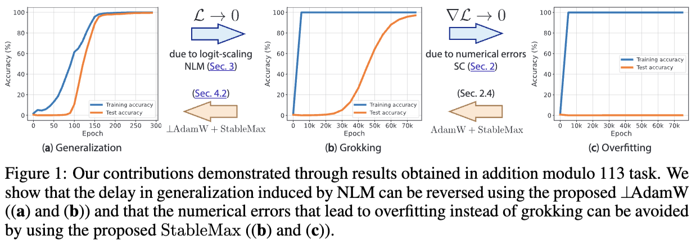

<p align="center">

  <h1 align="center"><a href="">Grokking at the Edge of Numerical Stability</a></h1>
  <p align="center">
    <a href="https://safeandtrustedai.org/person/lucas-prieto/"><strong>Lucas Prieto</strong></a>
    ·
    <a href="https://scholar.google.com.tr/citations?user=cmDBJlEAAAAJ&hl=en"><strong>Melih Barsbey</strong></a>
    ·
    <a href="https://pmediano.gitlab.io"><strong>Pedro Mediano</strong></a><sup>*</sup>
    ·
    <a href="https://tolgabirdal.github.io/"><strong>Tolga Birdal</strong></a><sup>*</sup>
  </p>
  <p align="center">
    <strong>Imperial College London</strong></a>
  </p>
  <p align="center">
    <strong>Under Review</strong></a>
  </p>
  <div align="center">
    
  </div>

</p>


<br/>
This is the official implementation of our paper <a href="https://arxiv.org/abs/2501.04697" target="_blank"><i>Grokking at the Edge of Numerical Stability</i></a> (arXiv: 2501.04697). Here you can find guidance to reproduce the main results of the paper.
<br/>

## Replicating Our Results

To replicate the main figures from our paper, use the `run_main_experiments.sh` script. This script generates and logs all necessary metrics for the primary figures (Figures **1**, **2**, **4**, and **6**), and uses `cuda:0` by default. Once the relevant metrics have been saved, you can generate the figures from the paper using [paper_plots.ipynb](https://github.com/LucasPrietoAl/grokking-at-the-edge-of-numerical-stability/blob/main/paper_plots.ipynb).

### Usage

```bash
./run_main_experiments.sh [--figures FIGURE_LIST] [--device DEVICE]
```

## Requirements

1. **Install PyTorch:**
   
   Visit the [PyTorch Get Started](https://pytorch.org/get-started/locally/) page to choose the appropriate installation command for your system.

2. **Install Python Packages:**
   Install the remaining dependencies using `pip`:
   ```
   pip install pandas==2.2.3
   pip install matplotlib==3.10.0
   ```

## Citation

If you found this code or paper useful, please consider citing:

```shell
@article{prieto2025grokking,
  title={Grokking at the Edge of Numerical Stability},
  author={Prieto, Lucas and Barsbey, Melih and Mediano, Pedro and Birdal, Tolga},
  year = {2025},
  eprint={2501.04697},
  archivePrefix={arXiv},
  primaryClass={cs.CV}
}
```
